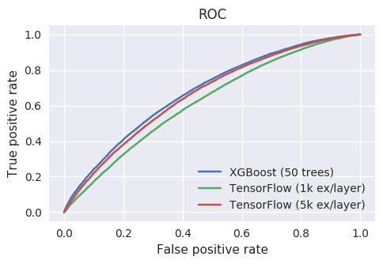

# Gradient Boosting in TensorFlow vs XGBoost

TensorFlow 1.4 includes a Gradient Boosting implementation, aptly named
TensorFlow Boosted Trees (TFBT). This repo contains the benchmarking code
that I used to compare it [XGBoost](https://github.com/dmlc/xgboost).

For more background, have a look at [the article](https://nicolovaligi.com/gradient-boosting-tensorflow-xgboost.html).



## Getting started

```
# Prepare the python environment
mkvirtualenv env
source env/bin/activate
pip install -r requirements.txt

# Download the dataset
wget http://stat-computing.org/dataexpo/2009/{2006,2007}.csv.bz2
bunzip2 {2006,2007}.csv.bz2

# Prepare the dataset
python preprocess_data.py
```

## Running the experiments

Train and run xgboost:

```
python do_xgboost.py
```

Train and run TensorFlow:

```
python do_tensorflow.py
```

Draw nice plots:

```
python analyze_results.py
```

## Timing results

```
./do_xgboost.py --num_trees=50  42.06s user 1.82s system 1727% cpu 2.540 total

./do_tensorflow.py --num_trees=50 --examples_per_layer=1000  124.12s user 27.50s system 374% cpu 40.456 total
./do_tensorflow.py --num_trees=50 --examples_per_layer=5000  659.74s user 188.80s system 356% cpu 3:58.30 total
```
